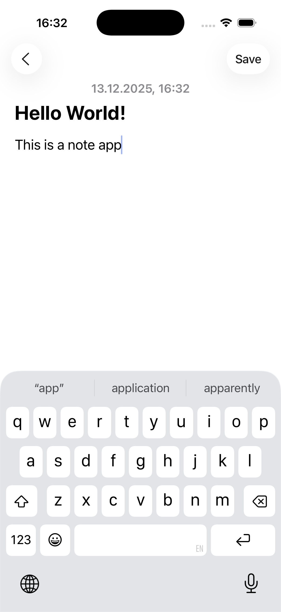
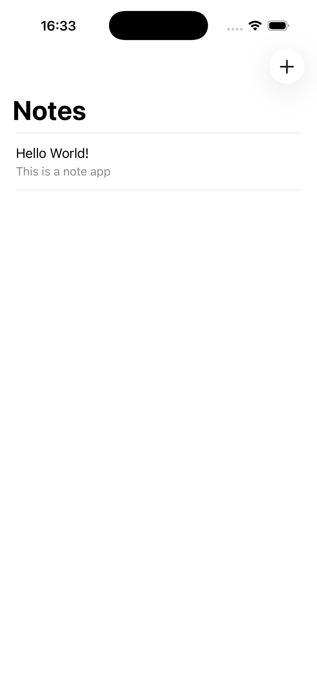
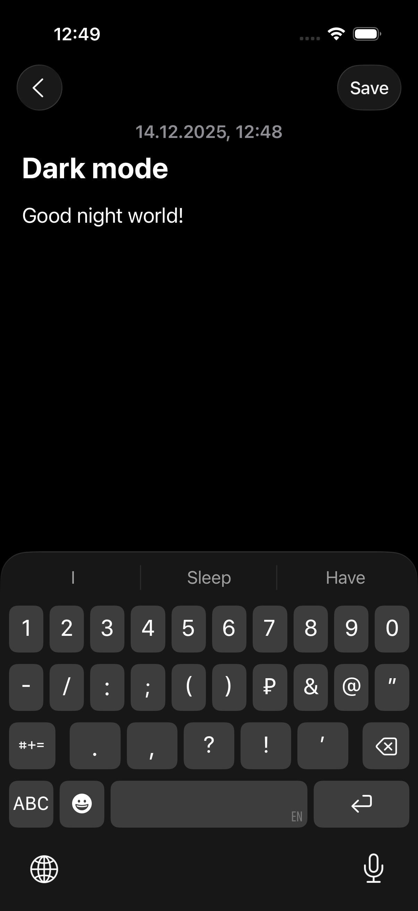
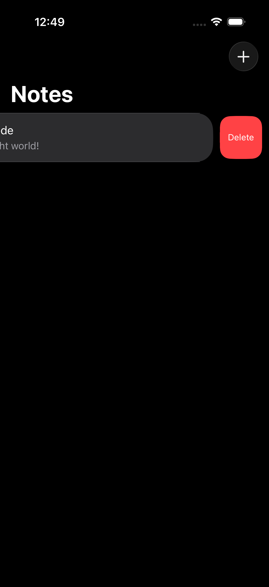

# NotesHW

Простое iOS-приложение для создания и управления заметками, разработанное в рамках учебного проекта.

## Описание проекта

Приложение позволяет пользователям создавать, просматривать, редактировать и удалять заметки. Все данные сохраняются локально на устройстве с использованием FileManager.

## Задача

Реализовать приложение для работы с заметками со следующим функционалом:

- При открытии приложения пользователь видит список всех заметок в таблице
- Нажатие на кнопку «Добавить» открывает новый экран для ввода текста заметки
- Заметки сохраняются в папку Documents с помощью FileManager
- Список автоматически обновляется, показывая все сохранённые заметки

## Решение

Приложение реализовано с использованием архитектуры MVC и состоит из следующих компонентов:

- **Note** — модель данных заметки с полями: id, title, body, date
- **NotesManager** — класс для управления сохранением и загрузкой заметок из файловой системы
- **NotesTableViewController** — главный экран со списком всех заметок в виде таблицы
- **NoteViewController** — экран для создания и редактирования заметок

### Основные возможности:

- Создание новых заметок через кнопку "+" в навигационной панели
- Просмотр и редактирование существующих заметок по нажатию на ячейку
- Удаление заметок свайпом влево
- Автоматическое сохранение данных при закрытии экрана
- Приветственная заметка при первом запуске приложения

## Технологический стек

- **Язык**: Swift
- **Фреймворк**: UIKit
- **Архитектура**: MVC (Model-View-Controller)
- **Хранение данных**: FileManager (Documents directory)
- **Сериализация**: JSONEncoder/JSONDecoder (Codable)

## Скриншоты

<table>
  <tr>
    <td style="border: none;"></td>
    <td style="border: none;"></td>
    <td style="border: none;"></td>
    <td style="border: none;"></td>
  </tr>
</table>

